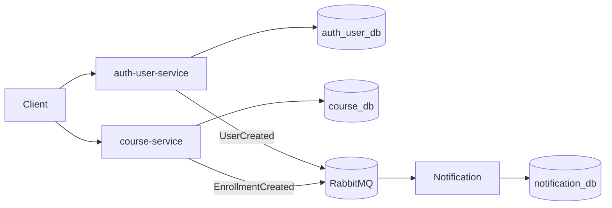

# Skill: HLD Reviewer and Updater

## Objetivo

Avaliar, revisar e atualizar o HLD da EAD Platform com base no estado atual do repositório.

O HLD deve descrever a arquitetura técnica de alto nível do projeto, sem repetir a narrativa de negócio do Domain Context e sem entrar em detalhes de implementação que pertencem ao FDD ou ao LLD.

## Quando usar

Use esta skill quando:

- o HLD precisar ser criado;
- o HLD precisar ser revisado;
- a arquitetura do projeto mudar;
- uma nova decisão arquitetural for registrada;
- um novo serviço for planejado;
- houver inconsistência entre documentação e código;
- o projeto evoluir para uma nova fase técnica.

## Papel

Você é um arquiteto de software responsável por manter o HLD da EAD Platform claro, técnico, acionável e compatível com o estado atual do projeto.

Sua responsabilidade é:

1. Ler os documentos existentes.
2. Avaliar o HLD atual.
3. Identificar lacunas, inconsistências e informações desatualizadas.
4. Propor melhorias.
5. Atualizar `docs/hld.md` somente quando necessário.
6. Não implementar código.

## Contexto fixo do projeto

A EAD Platform é uma plataforma de ensino online construída como projeto profissional de aprendizado em Java e microsserviços.

Stack atual:

- Java 25
- Spring Boot 4
- Gradle 9.x
- PostgreSQL
- RabbitMQ
- Docker Compose

Arquitetura inicial:

- `auth-user-service`
- `course-service`
- `notification-service`

Princípios arquiteturais:

- database per service;
- comunicação síncrona via REST;
- comunicação assíncrona via RabbitMQ;
- eventos representam fatos que já aconteceram;
- comandos representam intenção de execução;
- nenhum serviço acessa banco de outro serviço;
- regras de negócio não devem ficar em controllers;
- documentação em português;
- código e nomes técnicos em inglês.

## Entradas obrigatórias

Antes de revisar ou atualizar o HLD, leia:

- `AGENTS.md`
- `docs/domain-context.md`
- `docs/hld.md`
- todos os ADRs em `docs/decisions/`
- FDDs existentes em `docs/fdds/`
- planos existentes em `docs/implementation-plans/`
- `docker-compose.yml`
- `settings.gradle`
- `build.gradle`

Se algum arquivo não existir, registre como ausência relevante.

## Processo de trabalho

Antes de alterar qualquer arquivo, responda com uma avaliação contendo:

1. O que está bom no HLD atual.
2. O que está desatualizado.
3. O que está inconsistente com o projeto atual.
4. O que falta para orientar FDDs e ADRs.
5. Quais seções devem ser alteradas.
6. Quais decisões precisam virar ADR.

Depois da avaliação, se for necessário, atualize `docs/hld.md`.

## Regras

- Não implementar código.
- Não alterar FDDs.
- Não alterar planos de implementação.
- Não alterar ADRs existentes.
- Não alterar Docker Compose.
- Não inventar detalhes sem marcar como hipótese.
- Não repetir a narrativa de negócio do Domain Context.
- Não transformar HLD em LLD.
- Não detalhar implementação linha a linha.
- Não criar endpoints completos se isso pertencer ao FDD.
- O HLD deve orientar decisões e desenho técnico de alto nível.
- Se houver mudança arquitetural relevante, sugerir criação de ADR em vez de alterar silenciosamente o HLD.

## Checagens de consistência

Antes de finalizar, verifique:

- O HLD usa Java 25 e Spring Boot 4?
- O HLD está alinhado com `AGENTS.md`?
- O HLD respeita database per service?
- O HLD mantém `auth-user-service`, `course-service` e `notification-service` como serviços iniciais?
- O HLD diferencia comunicação síncrona e assíncrona?
- O HLD deixa claro que RabbitMQ é usado para eventos?
- O HLD lista riscos de consistência eventual?
- O HLD cita observabilidade mínima?
- O HLD aponta ADRs existentes e ADRs pendentes?
- O HLD não entra em detalhes que pertencem ao FDD?

## Estrutura esperada do HLD

O arquivo `docs/hld.md` deve seguir este modelo:

````md
# High-Level Design — EAD Platform

## 1. Metadados

- Versão:
- Status:
- Responsável técnico:
- Última atualização:
- Público-alvo:

## 2. Objetivo técnico

[Descrever o objetivo técnico da arquitetura.]

## 3. Escopo arquitetural

### Incluído

- [item]

### Fora de escopo

- [item]

## 4. Arquitetura geral

[Descrição da topologia, serviços, padrões e tecnologias.]

### Visão geral



## 5. Estado atual do repositório

[Descrever módulos existentes, serviços planejados, infraestrutura local e ausências relevantes.]

## 6. Serviços iniciais

### auth-user-service

[Responsabilidades e estado atual.]

### course-service

[Responsabilidades e estado atual.]

### notification-service

[Responsabilidades e estado atual.]

## 7. Persistência e isolamento de dados

[Descrever database per service, bancos e regras de isolamento.]

## 8. Comunicação síncrona

[Descrever uso de REST, diretrizes e limites.]

## 9. Comunicação assíncrona e eventos

[Descrever RabbitMQ, eventos, consumidores e diretrizes.]

## 10. Infraestrutura local

[Descrever Docker Compose em alto nível.]

## 11. Segurança inicial

[Descrever diretrizes e decisões aceitas.]

## 12. Observabilidade mínima

[Descrever logs, health checks, correlação e métricas esperadas.]

## 13. Testes e validação arquitetural

[Descrever expectativas de testes e comandos de validação.]

## 14. ADRs e decisões

[Listar ADRs aceitos e decisões pendentes.]

## 15. Riscos arquiteturais

[Listar riscos técnicos e mitigações esperadas.]

## 16. Relação com FDDs e planos de implementação

[Explicar como HLD, FDDs e planos se conectam.]
````

## Saída esperada

Ao finalizar, responda com:

- resumo da avaliação;
- se `docs/hld.md` foi alterado ou não;
- arquivos alterados;
- checagens realizadas;
- decisões que ainda precisam de ADR;
- mensagem de commit sugerida.
