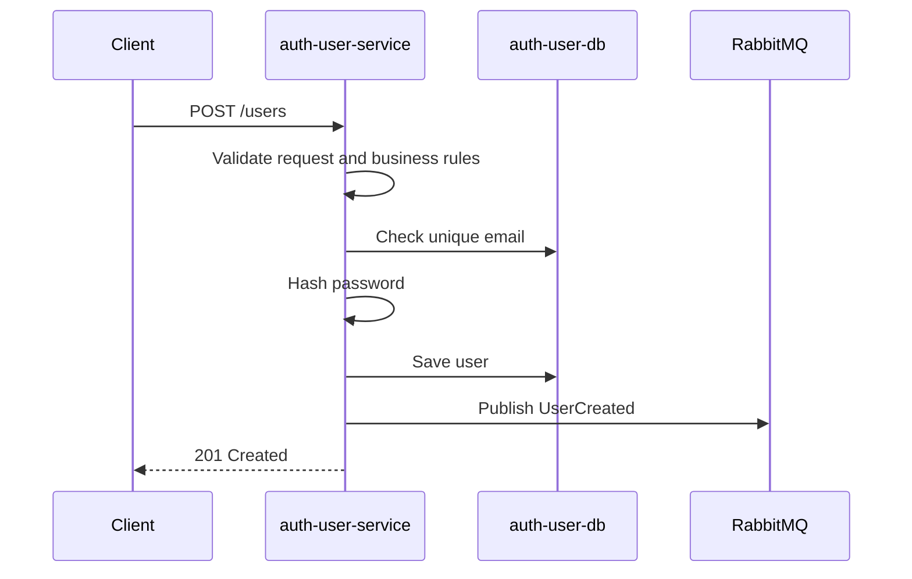

# FDD-001: Auth/User Service

## 1. Contexto e motivação técnica

O `auth-user-service` é o microsserviço responsável pelo bounded context Auth/User da EAD Platform. Ele será a fonte de verdade para usuários, credenciais, papéis e status de conta.

Este documento parte de:

- `docs/domain-context.md`;
- `docs/hld.md`;
- `docs/decisions/adr-001-microservices-database-per-service.md`.

A primeira entrega técnica do serviço deve implementar o cadastro de usuários, respeitando a decisão de microsserviços com database per service. O serviço terá seu próprio banco PostgreSQL e nenhum outro microsserviço poderá acessar diretamente suas tabelas, conexões, views ou procedures.

Essa entrega também inicia a comunicação assíncrona da plataforma com a publicação do evento `UserCreated` via RabbitMQ após a criação bem-sucedida de um usuário.

## 2. Objetivos técnicos

- Criar a primeira capacidade funcional do `auth-user-service`: cadastro de usuário.
- Validar nome, e-mail e senha antes da persistência.
- Garantir unicidade de e-mail dentro do banco do `auth-user-service`.
- Persistir senha somente como hash.
- Representar papéis com os valores `STUDENT`, `TEACHER` e `ADMIN`.
- Representar status de usuário com os valores `ACTIVE` e `BLOCKED`.
- Criar usuários inicialmente com status `ACTIVE`.
- Publicar o evento `UserCreated` após a criação do usuário.
- Expor um contrato HTTP simples para criação de usuário.
- Preparar base testável para evolução futura de autenticação e autorização.

## 3. Escopo e exclusões

### Incluído

- Endpoint `POST /users`.
- Criação de usuário.
- Validação de nome obrigatório.
- Validação de e-mail obrigatório e em formato válido.
- Validação de senha obrigatória.
- Validação de papéis permitidos.
- Exigência de ao menos um papel.
- Garantia de e-mail único.
- Hash de senha antes da persistência.
- Persistência de usuário no banco próprio do `auth-user-service`.
- Uso dos papéis `STUDENT`, `TEACHER` e `ADMIN`.
- Uso dos status `ACTIVE` e `BLOCKED`.
- Status inicial `ACTIVE`.
- Publicação do evento `UserCreated`.
- Tratamento de erros esperados.
- Observabilidade mínima para criação e publicação de evento.
- Testes unitários, de persistência, mensageria e contrato HTTP.

### Fora de escopo

- Login.
- JWT.
- Refresh token.
- Logout.
- Bloqueio de usuário.
- Desbloqueio de usuário.
- Troca ou recuperação de senha.
- Atualização de usuário.
- Remoção de usuário.
- Consulta de usuários.
- `course-service`.
- `notification-service`.
- Consumo de eventos.
- API Gateway.
- Autenticação entre microsserviços.

## 4. Fluxo principal

1. Cliente envia uma requisição `POST /users` com nome, e-mail, senha e papéis.
2. Controller valida o formato básico da entrada.
3. Application service executa o caso de uso de criação de usuário.
4. Domínio valida as regras de usuário, papéis e status inicial.
5. Serviço consulta o repositório para verificar se o e-mail já existe.
6. Senha em texto puro é transformada em hash por um componente dedicado.
7. Usuário é persistido no banco próprio do `auth-user-service`.
8. Evento `UserCreated` é montado com dados não sensíveis.
9. Evento `UserCreated` é publicado no RabbitMQ.
10. API retorna `201 Created` com os dados públicos do usuário criado.

Fluxo resumido:



## 5. Endpoint `POST /users`

Cria um novo usuário no `auth-user-service`.

Características:

- Deve ser público nesta primeira entrega, pois login e autenticação ainda estão fora de escopo.
- Deve aceitar somente os campos necessários para criação.
- Deve retornar apenas dados públicos do usuário.
- Não deve retornar senha nem hash da senha.
- Deve publicar `UserCreated` apenas quando a criação for concluída com sucesso.

Status de sucesso:

- `201 Created`.

Status de erro esperados:

- `400 Bad Request` para entrada inválida.
- `409 Conflict` para e-mail já cadastrado.
- `500 Internal Server Error` para falhas inesperadas.

## 6. Request e response

### Request

```json
{
  "name": "User Name",
  "email": "user@email.com",
  "password": "plainPassword",
  "roles": ["STUDENT"]
}
```

Regras:

- `name` é obrigatório e não pode ser vazio.
- `email` é obrigatório, não pode ser vazio e deve ter formato válido.
- `password` é obrigatória e não pode ser vazia.
- `roles` é obrigatório e deve conter ao menos um item.
- Cada papel deve ser um dos valores: `STUDENT`, `TEACHER` ou `ADMIN`.

### Response de sucesso

```json
{
  "id": "uuid",
  "name": "User Name",
  "email": "user@email.com",
  "status": "ACTIVE",
  "roles": ["STUDENT"],
  "createdAt": "2026-01-01T10:00:00Z"
}
```

Regras:

- `id` deve identificar o usuário criado.
- `status` deve ser `ACTIVE`.
- `roles` deve refletir os papéis persistidos.
- `createdAt` deve representar o momento de criação.
- A resposta nunca deve incluir `password` ou `passwordHash`.

## 7. Erros esperados

Formato recomendado:

```json
{
  "code": "USER_EMAIL_ALREADY_EXISTS",
  "message": "Email already exists.",
  "details": []
}
```

Erros:

| Situação | HTTP status | Código |
| --- | ---: | --- |
| Nome ausente ou vazio | 400 | `USER_NAME_REQUIRED` |
| E-mail ausente ou vazio | 400 | `USER_EMAIL_REQUIRED` |
| E-mail em formato inválido | 400 | `USER_EMAIL_INVALID` |
| Senha ausente ou vazia | 400 | `USER_PASSWORD_REQUIRED` |
| Papéis ausentes ou vazios | 400 | `USER_ROLE_REQUIRED` |
| Papel inválido | 400 | `USER_ROLE_INVALID` |
| E-mail já cadastrado | 409 | `USER_EMAIL_ALREADY_EXISTS` |
| Falha inesperada | 500 | `INTERNAL_ERROR` |

Regras:

- Erros de validação devem ser determinísticos e cobertos por testes.
- Erros internos não devem expor detalhes de banco, stack trace ou broker.
- Logs internos podem conter contexto técnico, mas nunca senha ou hash.

## 8. Evento `UserCreated`

O evento `UserCreated` deve ser publicado após a criação bem-sucedida de um usuário.

Payload:

```json
{
  "eventId": "uuid",
  "eventType": "UserCreated",
  "occurredAt": "2026-01-01T10:00:00Z",
  "payload": {
    "userId": "uuid",
    "name": "User Name",
    "email": "user@email.com"
  }
}
```

Regras:

- O evento representa um fato já ocorrido.
- `eventId` deve ser único.
- `eventType` deve ser `UserCreated`.
- `occurredAt` deve indicar quando o evento ocorreu.
- `payload.userId` deve ser o identificador do usuário criado.
- O evento não deve conter senha, hash de senha ou outros dados sensíveis.
- O evento deve ser publicado somente após a persistência bem-sucedida.

Observação:

- A convenção definitiva de exchange, routing key, retry e dead-letter queue ainda não está definida em ADR. A primeira implementação deve documentar qualquer escolha operacional em plano de implementação ou ADR se a decisão afetar a arquitetura.

## 9. Observabilidade mínima

Logs esperados:

- tentativa de criação de usuário, sem senha;
- falha de validação;
- tentativa de criação com e-mail duplicado;
- usuário criado com sucesso;
- tentativa de publicação do evento `UserCreated`;
- evento `UserCreated` publicado com sucesso;
- falha inesperada na criação ou publicação.

Health checks esperados:

- status da aplicação;
- conexão com PostgreSQL;
- conexão com RabbitMQ quando a publicação estiver ativa.

Correlação:

- Quando disponível, logs de requisição e logs de evento devem carregar um identificador de correlação.
- Logs de evento devem incluir `eventId`.

Dados sensíveis:

- Nunca registrar senha em texto puro.
- Nunca registrar hash de senha.

## 10. Dependências

Dependências técnicas da entrega:

- Java 21.
- Spring Boot 3.
- Banco PostgreSQL próprio do `auth-user-service`.
- RabbitMQ para publicação de eventos.
- Componente de hash de senha, preferencialmente BCrypt.
- Camada de persistência para usuários e papéis.
- Tratamento padronizado de erros HTTP.
- Testes automatizados.

Dependências arquiteturais:

- `docs/domain-context.md`.
- `docs/hld.md`.
- `docs/decisions/adr-001-microservices-database-per-service.md`.
- Infraestrutura local com PostgreSQL e RabbitMQ.

Não há dependência funcional de `course-service` ou `notification-service` para esta entrega.

## 11. Critérios de aceite técnicos

- `POST /users` cria um usuário válido e retorna `201 Created`.
- Usuário é persistido no banco próprio do `auth-user-service`.
- E-mail duplicado é rejeitado com `409 Conflict`.
- Nome ausente ou vazio é rejeitado com `400 Bad Request`.
- E-mail ausente, vazio ou inválido é rejeitado com `400 Bad Request`.
- Senha ausente ou vazia é rejeitada com `400 Bad Request`.
- Papéis ausentes, vazios ou inválidos são rejeitados com `400 Bad Request`.
- Senha é persistida somente como hash.
- A resposta HTTP não expõe senha nem hash.
- Usuários são criados com status `ACTIVE`.
- Os papéis `STUDENT`, `TEACHER` e `ADMIN` são aceitos.
- O status `BLOCKED` existe no modelo para uso futuro, mas não há fluxo de bloqueio nesta entrega.
- `UserCreated` é publicado após criação bem-sucedida.
- `UserCreated` não contém dados sensíveis.
- O serviço não acessa banco de outro microsserviço.
- Testes automatizados relevantes passam.
- O projeto compila.

## 12. Testes esperados

### Testes unitários

- Deve criar usuário válido com status `ACTIVE`.
- Deve rejeitar nome ausente ou vazio.
- Deve rejeitar e-mail ausente ou vazio.
- Deve rejeitar e-mail inválido.
- Deve rejeitar senha ausente ou vazia.
- Deve rejeitar papéis ausentes ou vazios.
- Deve rejeitar papel inválido.
- Deve aceitar `STUDENT`, `TEACHER` e `ADMIN`.
- Deve gerar hash de senha antes da persistência.
- Deve impedir exposição de senha e hash na resposta.

### Testes de persistência

- Deve persistir usuário válido.
- Deve persistir papéis associados ao usuário.
- Deve persistir status `ACTIVE`.
- Deve garantir unicidade de e-mail.
- Deve permitir consulta por e-mail para validação de duplicidade.

### Testes de mensageria

- Deve publicar `UserCreated` após criação bem-sucedida.
- Não deve publicar `UserCreated` quando a criação falhar.
- Evento publicado deve conter `eventId`, `eventType`, `occurredAt` e payload.
- Evento publicado não deve conter senha nem hash.

### Testes de contrato HTTP

- `POST /users` deve retornar `201 Created` para request válido.
- `POST /users` deve retornar `400 Bad Request` para entrada inválida.
- `POST /users` deve retornar `409 Conflict` para e-mail duplicado.
- Response de sucesso deve seguir o contrato definido.
- Response de erro deve seguir o formato definido.

## 13. Riscos e mitigação

| Risco | Mitigação |
| --- | --- |
| Falha ao publicar `UserCreated` após persistir o usuário pode gerar inconsistência. | Registrar erro com contexto, cobrir em testes e avaliar padrão outbox em ADR futura. |
| Cadastro público permitindo papel `ADMIN` pode ser inseguro em produção. | Aceitar nesta entrega de aprendizado, mas registrar como ponto para revisão antes de autenticação real. |
| Política de senha insuficiente pode reduzir segurança. | Definir validação mínima agora e evoluir política em FDD específico quando autenticação entrar no escopo. |
| Erros inconsistentes podem dificultar integração de clientes. | Padronizar formato de erro desde o primeiro endpoint e cobrir com testes de contrato. |
| Logs podem vazar dados sensíveis. | Proibir senha e hash em logs, responses e eventos; validar em revisão de código. |
| Convenções de RabbitMQ ainda não estão formalizadas. | Manter decisão operacional mínima no plano de implementação e criar ADR se a convenção se tornar arquitetural. |
| Duplicidade de e-mail pode ocorrer em concorrência se validada apenas na aplicação. | Usar restrição única no banco além da validação na aplicação. |
