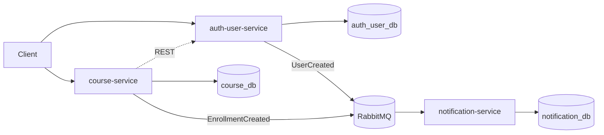

# High-Level Design — EAD Platform

## 1. Metadados

- Versão: 0.2
- Status: Em evolução
- Responsável técnico: EAD Platform
- Última atualização: 2026-05-10
- Público-alvo: desenvolvedores, revisores técnicos e agentes de IA que executam tarefas no repositório

## 2. Objetivo técnico

Definir a arquitetura técnica de alto nível da EAD Platform como um monorepo Gradle de microsserviços Java, com separação clara de responsabilidades, banco de dados por serviço, comunicação síncrona por REST, comunicação assíncrona por eventos via RabbitMQ e documentação rastreável por ADRs, FDDs e planos de implementação.

Este HLD orienta decisões arquiteturais e desenho técnico de alto nível. Detalhes de endpoints, payloads completos, tabelas, classes, migrações e tarefas linha a linha pertencem aos FDDs e planos de implementação.

## 3. Escopo arquitetural

### Incluído

- Arquitetura inicial com `auth-user-service`, `course-service` e `notification-service`.
- Monorepo Gradle multi-module.
- Stack base: Java 25, Spring Boot 4.0.6 e Gradle 9.x.
- Banco de dados PostgreSQL por serviço.
- RabbitMQ para eventos de domínio.
- Docker Compose para infraestrutura local.
- Limites entre comunicação REST e comunicação assíncrona.
- Regras arquiteturais para isolamento de dados, segurança, observabilidade e testes.
- Relação entre HLD, ADRs, FDDs e planos de implementação.

### Fora de escopo

- Detalhamento completo de endpoints HTTP.
- Modelagem física detalhada de tabelas e índices.
- Implementação de classes, pacotes ou métodos.
- Estratégia final de autenticação, JWT e autorização distribuída.
- Estratégia final de API Gateway.
- Topologia final de RabbitMQ, retry e dead-letter queue.
- Implementação do `course-service` e do `notification-service`.
- Contexto futuro de pagamento.

## 4. Arquitetura geral

A plataforma segue arquitetura de microsserviços com banco de dados por serviço. Cada serviço possui seu próprio modelo de domínio, API, persistência e regras internas. Nenhum serviço pode acessar diretamente o banco de dados de outro serviço.

O repositório é um monorepo Gradle multi-module:

- a raiz do projeto atua como agregadora Gradle e não deve ser uma aplicação executável;
- cada microsserviço deve viver em seu próprio módulo;
- o primeiro módulo existente é `auth-user-service`;
- módulos futuros esperados: `course-service` e `notification-service`.

Stack técnica atual:

- Java 25;
- Spring Boot 4.0.6;
- Gradle 9.x;
- PostgreSQL 16 para bancos locais;
- RabbitMQ 3 com Management UI;
- Docker Compose para infraestrutura local.

### Visão geral



## 5. Estado atual do repositório

Estado observado no código:

- `settings.gradle` define `rootProject.name = 'ead-platform'`.
- `settings.gradle` inclui o módulo `auth-user-service`.
- `build.gradle` da raiz configura plugins comuns e repositórios, sem tornar a raiz uma aplicação Spring Boot executável.
- `auth-user-service` existe como módulo Spring Boot.
- `auth-user-service` possui aplicação principal em `com.yuriromao.ead.authuser`.
- `auth-user-service` possui `application.yml` com `spring.application.name: auth-user-service` e `server.port: 8081`.
- `course-service` e `notification-service` ainda não existem como módulos de código.

Ausências relevantes:

- Não há implementação de criação de usuário ainda.
- Não há endpoint `POST /users` implementado ainda.
- Não há configuração de banco no `auth-user-service` ainda.
- Não há configuração de RabbitMQ no `auth-user-service` ainda.
- Existe FDD e plano de implementação apenas para a primeira entrega do `auth-user-service`.

## 6. Serviços iniciais

### auth-user-service

Responsável pelo bounded context Auth/User.

Responsabilidades arquiteturais:

- ser a fonte de verdade para usuários, credenciais, papéis e status de conta;
- manter seu próprio banco PostgreSQL;
- armazenar senhas somente como hash;
- aplicar a estratégia BCrypt definida no ADR-002;
- publicar `UserCreated` após criação bem-sucedida de usuário;
- expor APIs relacionadas a usuários e autenticação conforme FDDs específicos.

Estado atual:

- módulo criado;
- aplicação Spring Boot inicial movida para o módulo;
- fluxo de criação de usuário ainda pendente de implementação.

### course-service

Responsável pelo bounded context Course.

Responsabilidades arquiteturais planejadas:

- gerenciar cursos, módulos, aulas e matrículas;
- manter seu próprio banco PostgreSQL;
- validar dados de usuário via REST quando precisar de resposta imediata do `auth-user-service`;
- publicar `EnrollmentCreated` após criação bem-sucedida de matrícula.

Estado atual:

- planejado no HLD e no Domain Context;
- ainda não existe como módulo de código.

### notification-service

Responsável pelo bounded context Notification.

Responsabilidades arquiteturais planejadas:

- manter seu próprio banco PostgreSQL;
- consumir eventos relevantes publicados no RabbitMQ;
- registrar notificações derivadas de `UserCreated` e `EnrollmentCreated`;
- processar eventos de forma idempotente.

Estado atual:

- planejado no HLD e no Domain Context;
- ainda não existe como módulo de código.

## 7. Persistência e isolamento de dados

A decisão arquitetural aceita em `docs/decisions/adr-001-microservices-database-per-service.md` define database per service.

Distribuição inicial:

- `auth-user-service` usa `auth_user_db`;
- `course-service` usará `course_db`;
- `notification-service` usará `notification_db`.

Regras:

- um serviço nunca acessa tabelas, views, procedures, schemas ou conexões de banco de outro serviço;
- integrações entre serviços devem ocorrer por REST ou eventos;
- duplicação de dados entre serviços só deve existir quando necessária para autonomia local ou leitura otimizada;
- dados duplicados devem ser alimentados por eventos sempre que fizer sentido;
- migrações de banco devem pertencer ao módulo do serviço dono do banco.

## 8. Comunicação síncrona

A comunicação síncrona entre microsserviços deve ocorrer por REST APIs.

Uso inicial esperado:

- `course-service` consulta ou valida informações no `auth-user-service` quando precisar verificar permissões como `TEACHER` ou `ADMIN`;
- clientes externos interagem com `auth-user-service` para fluxos de usuário/autenticação e com `course-service` para fluxos de curso e matrícula.

Diretrizes:

- usar REST apenas quando a operação precisar de resposta imediata;
- definir timeouts para chamadas entre serviços;
- tratar falhas de comunicação como parte do fluxo da aplicação;
- retornar erros HTTP consistentes;
- versionar contratos quando houver quebra de compatibilidade;
- não usar REST para substituir eventos de domínio.

## 9. Comunicação assíncrona e eventos

A comunicação assíncrona entre microsserviços deve ocorrer via RabbitMQ.

Eventos representam fatos que já aconteceram. Comandos representam intenção de execução e não devem ser publicados como eventos de domínio.

Eventos iniciais:

- `UserCreated`, registrado em outbox pelo `auth-user-service` e publicado por relay assíncrono;
- `EnrollmentCreated`, publicado pelo `course-service`.

Consumidor inicial planejado:

- `notification-service`.

Diretrizes:

- cada evento deve possuir identificador único;
- cada evento deve possuir tipo e data/hora de ocorrência;
- eventos não devem carregar dados sensíveis como senha ou hash;
- produtores que adotam outbox devem persistir metadados e envelope sanitizado do evento no próprio banco antes da publicação no broker;
- consumidores devem ser idempotentes;
- falhas de consumo devem permitir retentativa;
- evolução de payloads deve preservar compatibilidade sempre que possível;
- a topologia final de exchange, routing key, retry e dead-letter queue deve ser registrada em ADR quando definida.

## 10. Infraestrutura local

A infraestrutura local é definida em `docker-compose.yml`.

Serviços locais:

| Serviço | Tecnologia | Porta host | Uso |
| --- | --- | ---: | --- |
| `rabbitmq` | RabbitMQ 3 Management | `5672`, `15672` | Mensageria e UI de administração |
| `auth-user-db` | PostgreSQL 16 | `5432` | Banco do `auth-user-service` |
| `course-db` | PostgreSQL 16 | `5433` | Banco do `course-service` |
| `notification-db` | PostgreSQL 16 | `5434` | Banco do `notification-service` |

Regras:

- cada banco local possui volume nomeado;
- cada serviço possui healthcheck básico;
- a infraestrutura local não cria microsserviços;
- Docker Compose é suporte de desenvolvimento, não substitui documentação arquitetural de produção.

## 11. Segurança inicial

O `auth-user-service` é a fonte de verdade para identidade, credenciais, papéis e status de usuário.

Decisão aceita:

- `docs/decisions/adr-002-password-hashing-strategy.md` define BCrypt como estratégia inicial de hash de senha.

Regras iniciais:

- senhas devem ser persistidas somente como hash;
- senha e hash nunca devem aparecer em resposta HTTP, log ou evento;
- detalhes de autenticação, JWT, refresh token e validação entre serviços estão fora do escopo atual;
- criação de cursos deve depender de autorização baseada em papéis quando o `course-service` for implementado;
- regras de negócio não devem ficar em controllers.

Decisões pendentes:

- formato e assinatura de tokens;
- estratégia de validação de token entre serviços;
- autenticação entre microsserviços;
- exposição direta dos serviços ou uso de API Gateway.

## 12. Observabilidade mínima

A observabilidade deve permitir diagnóstico básico de requisições, falhas e eventos.

Itens mínimos esperados:

- health checks por aplicação;
- health checks de dependências críticas, como PostgreSQL e RabbitMQ, quando configuradas;
- logs estruturados por serviço;
- identificador de correlação em requisições HTTP;
- `eventId` ou identificador de correlação no processamento de eventos;
- logs para publicação e consumo de eventos;
- logs para registro e atualização de outbox quando o serviço produtor usar esse padrão;
- métricas básicas de disponibilidade, latência e erros;
- métricas ou logs de filas, consumo e falhas de processamento no RabbitMQ.

Ferramentas específicas de métricas, tracing e dashboard ainda não foram decididas e devem ser tratadas em ADR futura.

## 13. Testes e validação arquitetural

Cada funcionalidade deve incluir testes compatíveis com seu risco e superfície.

Expectativas gerais:

- testes unitários para regras de domínio e aplicação;
- testes de persistência quando houver banco;
- testes de mensageria quando houver publicação ou consumo de eventos;
- testes de controller para contratos HTTP;
- build do módulo afetado antes de concluir a tarefa.

Comandos atuais para o módulo existente:

```bash
./gradlew :auth-user-service:test
./gradlew :auth-user-service:build
```

## 14. ADRs e decisões

### ADRs aceitos

- `ADR-001: Microservices with Database per Service`
  - Define microsserviços com banco por serviço.
  - Rejeita banco compartilhado.

- `ADR-002: Password Hashing Strategy`
  - Define BCrypt como estratégia inicial de hash de senha.
  - Rejeita senha em texto puro.

- `ADR-006: Transactional Outbox for Domain Events`
  - Define outbox transacional para eventos de domínio do `auth-user-service`.
  - Reduz perda de `UserCreated` após persistência local.

- `ADR-007: RabbitMQ Topology and Retry/DLQ Strategy`
  - Define exchange principal, retry exchange, DLX, routing keys e filas de consumidores.
  - Separa retry de publicação no produtor e retry de processamento no consumidor.

### Decisões que precisam virar ADR

- Estratégia de migração de banco por serviço.
- Versionamento de APIs REST.
- Versionamento de eventos.
- Estratégia de autenticação e formato de token.
- Autenticação entre microsserviços.
- Estratégia de API Gateway ou exposição direta.
- Ferramenta de métricas, tracing e dashboards.

## 15. Riscos arquiteturais

Riscos atuais:

- falha ao publicar eventos após persistência local pode gerar inconsistência entre serviços quando o produtor ainda não usa outbox;
- consumidores não idempotentes podem processar eventos duplicados;
- ausência de retry e dead-letter queue pode dificultar recuperação de falhas;
- dependência excessiva de chamadas REST do `course-service` para o `auth-user-service` pode gerar acoplamento operacional;
- ausência de estratégia de autenticação pode atrasar fluxos protegidos;
- permitir papéis sensíveis em cadastro público exigirá revisão antes de uso real;
- crescimento de contratos REST e eventos sem versionamento pode gerar quebra de compatibilidade;
- falta de correlação distribuída pode dificultar diagnóstico em fluxos entre serviços.

Mitigações esperadas:

- criar ADR para publicação confiável de eventos antes de fluxos críticos;
- exigir idempotência em consumidores;
- definir retry e dead-letter queue antes de consumidores reais;
- manter validações síncronas apenas quando houver necessidade de resposta imediata;
- documentar autenticação em FDD/ADR próprios;
- incluir correlação e logs estruturados desde as primeiras integrações.

## 16. Relação com FDDs e planos de implementação

O HLD define limites e decisões de alto nível. FDDs e planos transformam essas decisões em funcionalidades e tarefas executáveis.

Documentos atuais:

- `docs/fdds/fdd-001-auth-user-service.md`
  - Define a primeira entrega funcional do `auth-user-service`.
  - Cobre criação de usuário, validações, hash BCrypt, papéis, status e `UserCreated`.

- `docs/implementation-plans/plan-001-auth-user-service.md`
  - Quebra o FDD em tarefas pequenas.
  - Inclui bootstrap do módulo, configuração futura de banco, migrações, domínio, endpoint, hash, evento, RabbitMQ e testes.

Regra de evolução:

- novos recursos devem partir de Domain Context, HLD, ADRs aplicáveis, FDD e plano de implementação;
- mudanças de arquitetura devem criar ou atualizar ADR;
- implementação não deve alterar os princípios deste HLD sem documentação correspondente.
