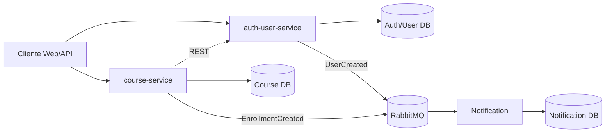
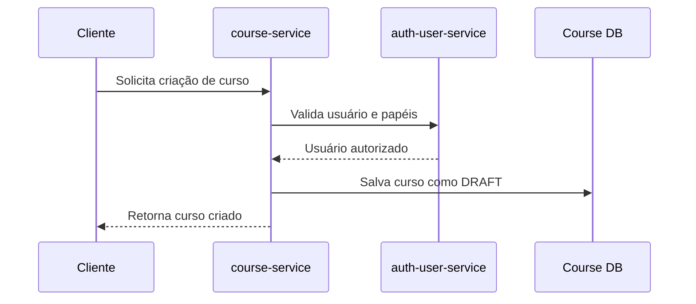
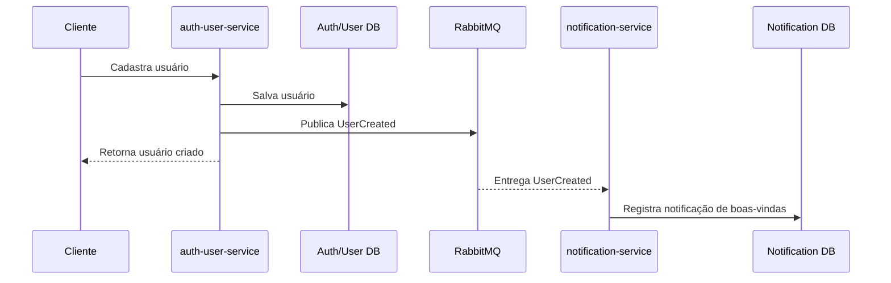
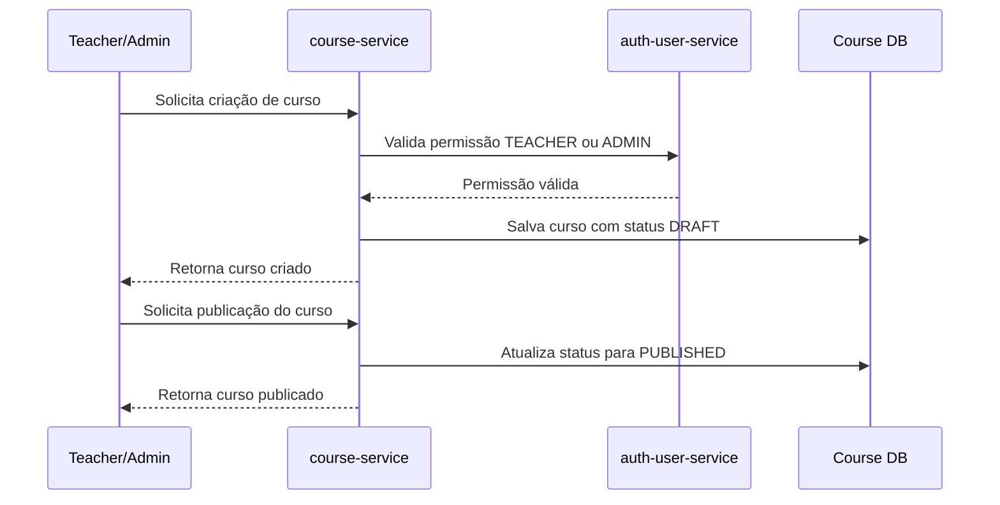
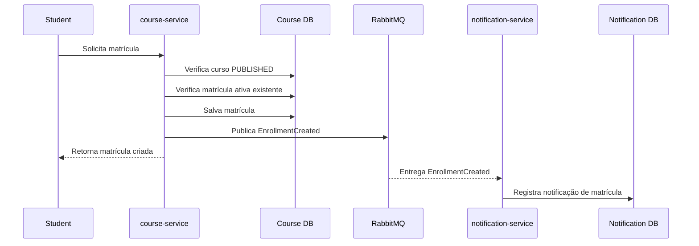

# High-Level Design — EAD Platform

## 1. Objetivo técnico

Definir a arquitetura inicial da EAD Platform como um MVP técnico em microsserviços, orientado à separação clara de responsabilidades, banco de dados por serviço, comunicação síncrona por HTTP, comunicação assíncrona por eventos e base mínima para evolução com testes, segurança e observabilidade.

Este documento parte do contexto descrito em `docs/domain-context.md` e não define implementação de código nem infraestrutura com Docker Compose.

## 2. Arquitetura geral

A plataforma será composta inicialmente por três microsserviços Java com Spring Boot:

- `auth-user-service`
- `course-service`
- `notification-service`

Cada serviço será responsável por seu próprio modelo de domínio, API, persistência e regras internas. Nenhum serviço poderá acessar diretamente o banco de dados de outro serviço.

A comunicação entre serviços seguirá dois modelos:

- síncrona, via REST APIs, para consultas ou validações necessárias durante uma operação;
- assíncrona, via RabbitMQ, para publicação e consumo de eventos de domínio.

Visão geral:



## 3. Serviços iniciais

Os serviços iniciais representam os bounded contexts já definidos para o MVP:

- Auth/User
- Course
- Notification

O contexto Payment existe como evolução futura e não faz parte da arquitetura inicial.

## 4. Responsabilidade de cada serviço

### auth-user-service

Responsável por usuários, autenticação, autorização e eventos relacionados a usuários.

Responsabilidades iniciais:

- cadastrar usuários;
- garantir unicidade de e-mail;
- armazenar senha apenas como hash;
- gerenciar papéis `STUDENT`, `TEACHER` e `ADMIN`;
- impedir autenticação de usuários bloqueados;
- publicar o evento `UserCreated` após a criação de usuário.

### course-service

Responsável por cursos, módulos, aulas e matrículas.

Responsabilidades iniciais:

- criar cursos;
- manter cursos inicialmente com status `DRAFT`;
- publicar cursos;
- permitir matrícula apenas em cursos `PUBLISHED`;
- impedir matrícula ativa duplicada para o mesmo aluno no mesmo curso;
- validar permissões de criação de curso sem acessar diretamente o banco do Auth/User Service;
- publicar o evento `EnrollmentCreated` após a criação de matrícula.

### notification-service

Responsável por consumir eventos e registrar notificações.

Responsabilidades iniciais:

- consumir `UserCreated`;
- registrar notificação de boas-vindas;
- consumir `EnrollmentCreated`;
- registrar notificação de matrícula;
- manter o histórico e estado das notificações.

## 5. Banco de dados por serviço

Cada microsserviço deve possuir seu próprio banco de dados lógico e seu próprio schema de persistência.

Distribuição inicial:

- `auth-user-service`: usuários, papéis, credenciais e status de conta;
- `course-service`: cursos, módulos, aulas e matrículas;
- `notification-service`: notificações geradas, status de envio e metadados de processamento.

Regras:

- um serviço nunca acessa tabelas, views, procedures ou conexões de banco de outro serviço;
- integrações entre serviços devem ocorrer por REST ou eventos;
- dados duplicados entre serviços só devem existir quando forem necessários para autonomia ou leitura local, e devem ser alimentados por eventos.

## 6. Comunicação síncrona

A comunicação síncrona entre microsserviços deve ocorrer por REST APIs.

Uso inicial esperado:

- `course-service` consulta ou valida informações de usuário no `auth-user-service` quando precisar verificar permissões como `TEACHER` ou `ADMIN`;
- clientes externos interagem com `auth-user-service` para cadastro/autenticação e com `course-service` para cursos e matrículas.

Diretrizes:

- chamadas REST devem ser usadas apenas quando a operação precisa de resposta imediata;
- contratos HTTP devem ser versionados quando necessário;
- erros devem ser retornados com códigos HTTP consistentes;
- timeouts devem ser definidos para evitar bloqueios indefinidos;
- falhas de comunicação devem ser tratadas como parte do fluxo da aplicação.

Fluxo síncrono inicial para criação de curso:



## 7. Comunicação assíncrona

A comunicação assíncrona entre microsserviços deve ocorrer via RabbitMQ.

Eventos devem representar fatos que já aconteceram, não intenções de execução. Comandos representam intenção e não devem ser publicados como eventos de domínio.

Uso inicial esperado:

- `auth-user-service` publica `UserCreated`;
- `course-service` publica `EnrollmentCreated`;
- `notification-service` consome eventos relevantes e registra notificações.

Diretrizes:

- cada evento deve possuir identificador único;
- cada evento deve possuir tipo e data/hora de ocorrência;
- consumidores devem ser idempotentes;
- falhas de consumo devem permitir retentativa;
- a evolução de payloads deve manter compatibilidade sempre que possível.

## 8. Eventos iniciais

### UserCreated

Publicado pelo `auth-user-service` quando um novo usuário é criado.

Payload inicial:

```json
{
  "eventId": "uuid",
  "eventType": "UserCreated",
  "occurredAt": "2026-01-01T10:00:00Z",
  "payload": {
    "userId": "uuid",
    "name": "User Name",
    "email": "user@email.com"
  }
}
```

Consumidor inicial:

- `notification-service`

Efeito esperado:

- registrar notificação de boas-vindas.

### EnrollmentCreated

Publicado pelo `course-service` quando uma matrícula é criada.

Payload inicial proposto:

```json
{
  "eventId": "uuid",
  "eventType": "EnrollmentCreated",
  "occurredAt": "2026-01-01T10:00:00Z",
  "payload": {
    "enrollmentId": "uuid",
    "studentId": "uuid",
    "courseId": "uuid"
  }
}
```

Consumidor inicial:

- `notification-service`

Efeito esperado:

- registrar notificação de matrícula.

## 9. Fluxos principais em Mermaid

### Cadastro de usuário e notificação de boas-vindas



### Criação e publicação de curso



### Matrícula e notificação



## 10. Segurança inicial

O `auth-user-service` será a fonte de verdade para identidade, credenciais, papéis e status de usuário.

Regras iniciais:

- senhas devem ser persistidas apenas como hash;
- usuários bloqueados não podem autenticar;
- autorização deve considerar os papéis `STUDENT`, `TEACHER` e `ADMIN`;
- criação de cursos deve ser permitida apenas para `TEACHER` ou `ADMIN`;
- endpoints sensíveis devem exigir autenticação;
- serviços não devem usar acesso direto ao banco para validar permissões.

Decisões ainda pendentes:

- formato final do token de autenticação;
- estratégia de validação de token entre serviços;
- política de expiração e renovação de sessão;
- autenticação entre microsserviços.

## 11. Observabilidade inicial

A observabilidade inicial deve permitir diagnóstico básico de requisições, falhas e consumo de eventos.

Itens mínimos esperados:

- logs estruturados por serviço;
- identificador de correlação em requisições HTTP;
- identificador de correlação ou `eventId` no processamento de eventos;
- logs para publicação e consumo de eventos;
- health checks por serviço;
- métricas básicas de disponibilidade, latência e erros;
- métricas básicas de filas, consumo e falhas de processamento no RabbitMQ.

## 12. Riscos arquiteturais

Riscos iniciais:

- acoplamento excessivo se o `course-service` depender de muitas chamadas síncronas ao `auth-user-service`;
- inconsistência eventual entre eventos publicados e estados locais dos consumidores;
- duplicidade de processamento de eventos sem idempotência;
- perda de eventos se publicação e persistência não forem coordenadas;
- crescimento de contratos REST e eventos sem versionamento;
- dificuldade de rastrear fluxos distribuídos sem correlação adequada;
- regras de autorização espalhadas fora do Auth/User Service;
- evolução futura do contexto Payment impactando matrícula e liberação de acesso.

## 13. Decisões pendentes

Decisões que devem ser registradas futuramente, preferencialmente por ADR quando alterarem arquitetura:

- tecnologia de banco de dados de cada serviço;
- estratégia de migração de banco;
- formato e assinatura dos tokens de autenticação;
- padrão de autenticação entre microsserviços;
- estratégia de API Gateway ou exposição direta dos serviços;
- convenção de exchanges, filas e routing keys no RabbitMQ;
- padrão de retry, dead-letter queue e idempotência para consumidores;
- estratégia de versionamento de APIs REST e eventos;
- estratégia para garantir publicação confiável de eventos;
- ferramenta de métricas, tracing e dashboards;
- entrada do contexto Payment na arquitetura.
