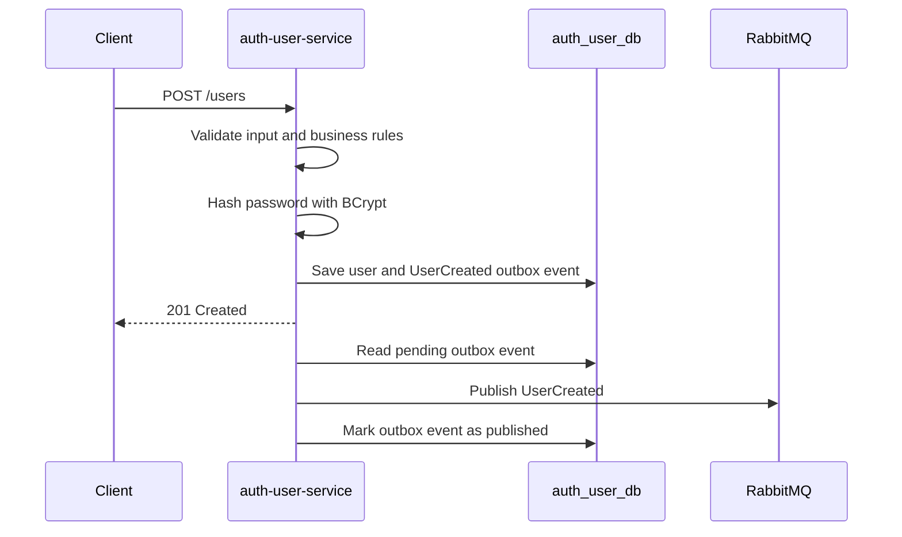

# HLD-001: auth-user-service

## 1. Metadados

- Versão: 0.1
- Status: Draft
- Responsável técnico: EAD Platform
- Última atualização: 2026-05-10
- Público-alvo: desenvolvedores, revisores técnicos e agentes de IA

## 2. Objetivo técnico

Descrever a arquitetura de alto nível do `auth-user-service`, responsável pelo bounded context Auth/User da EAD Platform.

O componente resolve o problema arquitetural de centralizar identidade, credenciais, papéis e status de usuários, mantendo propriedade exclusiva sobre seus dados e publicando eventos de domínio relacionados a usuários.

## 3. Escopo arquitetural

### Incluído

- Módulo `auth-user-service` no monorepo Gradle.
- Gestão técnica de usuários, credenciais, papéis e status.
- Banco próprio `auth_user_db`.
- Hash de senha com BCrypt.
- Registro transacional de `UserCreated` na outbox e publicação assíncrona via RabbitMQ.
- Contratos REST relacionados ao contexto Auth/User, conforme FDDs específicos.

### Fora de escopo

- Implementação detalhada de endpoints.
- Login, JWT e refresh token na primeira entrega.
- Bloqueio e desbloqueio de usuários na primeira entrega.
- Regras de cursos, matrículas e notificações.
- Consumo de eventos.
- Acesso direto a bancos de outros serviços.

## 4. Responsabilidades

O `auth-user-service` deve:

- ser a fonte de verdade para usuários;
- armazenar credenciais de forma segura;
- manter papéis `STUDENT`, `TEACHER` e `ADMIN`;
- manter status `ACTIVE` e `BLOCKED`;
- garantir unicidade de e-mail dentro do próprio serviço;
- registrar `UserCreated` na outbox após criação bem-sucedida de usuário;
- publicar eventos pendentes da outbox no RabbitMQ por publisher assíncrono;
- expor APIs do contexto Auth/User;
- prover dados de autorização para outros serviços por contrato REST futuro.

## 5. Arquitetura interna de alto nível

O serviço deve seguir separação por camadas:

- domínio: regras e modelo do contexto Auth/User;
- aplicação: casos de uso, portas e orquestração;
- infraestrutura web: controllers, requests, responses e tratamento HTTP;
- infraestrutura de persistência: adapters para PostgreSQL;
- infraestrutura de mensageria: adapter de publicação RabbitMQ;
- infraestrutura de segurança: adapter de hash BCrypt.

Controllers não devem conter regras de negócio. Regras de usuário, validação de papéis, status e segurança de senha devem ficar no domínio ou na aplicação.

## 6. Dependências

### Dependências internas

- HLD global em `docs/hld.md`.
- FDD `docs/fdds/fdd-001-auth-user-service.md`.
- Plano `docs/implementation-plans/plan-001-auth-user-service.md`.
- Futuro uso pelo `course-service` para validação de usuário e papéis via REST.

### Dependências externas

- PostgreSQL `auth_user_db`.
- RabbitMQ para publicação de eventos.
- Spring Boot 4.
- Gradle 9.x.
- Java 25.

## 7. Modelo de dados em alto nível

Fonte de verdade:

- `auth-user-service` é dono dos dados de usuários, credenciais, papéis e status.

Entidades principais:

- `User`: representa um usuário da plataforma.
- `Role`: representa papéis `STUDENT`, `TEACHER` e `ADMIN`.
- `UserStatus`: representa `ACTIVE` e `BLOCKED`.

Dados sensíveis:

- senha em texto puro nunca deve ser persistida;
- apenas `passwordHash` deve ser armazenado;
- senha e hash nunca devem ser retornados por API nem publicados em eventos.

## 8. Interfaces públicas

| Interface | Tipo | Descrição | Status |
| --- | --- | --- | --- |
| `POST /users` | REST | Criação de usuário definida no FDD-001. | implemented |
| `UserCreated` | Event | Evento registrado na outbox após criação bem-sucedida de usuário e publicado assincronamente por publisher. | implemented |
| User validation API | REST | Interface futura para validação de usuário e papéis por outros serviços. | draft |

## 9. Comunicação síncrona

O serviço receberá chamadas REST de clientes externos e, futuramente, de outros serviços.

Comunicação prevista:

- clientes chamam `POST /users` para criação de usuário;
- `course-service` poderá consultar o `auth-user-service` para validar permissões como `TEACHER` ou `ADMIN`.

Diretrizes:

- chamadas REST devem ter contratos versionáveis;
- respostas não devem expor senha nem hash;
- falhas devem retornar erros HTTP consistentes;
- timeouts devem ser definidos em chamadas entre serviços.

## 10. Comunicação assíncrona

O serviço deve produzir eventos relacionados a usuários por meio da outbox transacional definida no ADR-006.

Eventos implementados:

- `UserCreated`, registrado na tabela `outbox_events` na mesma transação que persiste o usuário e publicado posteriormente no RabbitMQ por publisher assíncrono.

A tabela `outbox_events` pertence ao banco do `auth-user-service`. Ela guarda `id`, `aggregate_type`, `aggregate_id`, `event_type`, `event_id`, `payload` JSONB, `status`, `attempts`, `last_error`, `next_attempt_at`, `created_at`, `published_at` e `updated_at`. O `payload` JSONB armazena o envelope sanitizado do evento para preservar `occurredAt` sem expor senha ou hash.

No nível arquitetural, a outbox é a fonte local de verdade para eventos pendentes de publicação. O publisher assíncrono já está implementado no producer: ele busca apenas registros `PENDING` elegíveis, publica o evento no broker e atualiza o estado para `PUBLISHED` ou `FAILED` conforme o resultado das tentativas.

O serviço não deve consumir eventos nesta primeira fase.

O evento `UserCreated` não deve conter senha, hash ou outros dados sensíveis.

## 11. Fluxos principais

### Criação de usuário e publicação de evento

## 12. Segurança

Diretrizes:

- senhas devem ser tratadas como dado sensível;
- BCrypt é a estratégia inicial de hash;
- o endpoint de criação de usuário pode ser público na primeira entrega, conforme FDD-001;
- o cadastro público deve aceitar apenas `STUDENT`; criação de `TEACHER` ou `ADMIN` deve depender de fluxo administrativo protegido futuro;
- login, JWT e refresh token exigem FDD e ADR próprios;
- logs não devem conter senha nem hash.

## 13. Observabilidade

O serviço deve registrar:

- tentativa de criação de usuário sem dados sensíveis;
- falhas de validação;
- conflito por e-mail duplicado;
- sucesso na criação de usuário;
- tentativa e resultado de registro de `UserCreated` na outbox;
- tentativa e resultado de publicação assíncrona de eventos pendentes.

Health checks esperados:

- aplicação;
- PostgreSQL quando configurado;
- RabbitMQ quando configurado.

Logs de evento devem incluir `eventId`. Logs HTTP devem carregar correlation id quando essa capacidade for introduzida.

### Testes e validação esperados

O `auth-user-service` deve ser validado com:

- testes unitários para regras de domínio e casos de uso;
- testes unitários para hash de senha com BCrypt;
- testes unitários para montagem de `UserCreated`;
- testes de contrato HTTP para APIs públicas;
- testes de persistência quando `auth_user_db` for configurado;
- testes de integração para fluxos de criação de usuário de ponta a ponta;
- testes de integração cobrindo registro de `UserCreated` na outbox após criação bem-sucedida;
- testes de persistência para schema, constraints e índices de `outbox_events`;
- testes do publisher assíncrono para publicação de eventos pendentes;
- testes negativos para nome, e-mail, senha e papéis inválidos.

Cenários de integração devem descrever comportamento observável do serviço, não detalhes de classes ou implementação interna.

## 14. Escalabilidade, resiliência e disponibilidade

Considerações:

- o serviço deve poder escalar horizontalmente quando não mantiver estado em memória;
- unicidade de e-mail deve ser garantida também no banco;
- hash BCrypt é CPU-intensive e pode limitar throughput;
- outbox reduz perda de evento, mas exige retry e limpeza operacional;
- timeouts devem ser definidos para integrações REST futuras.

O ADR-006 define outbox transacional para eventos de domínio do `auth-user-service`. O ADR-007 complementa a estratégia inicial de retry do producer e a topologia de mensageria. Permanecem em aberto as decisões operacionais de reprocessamento manual e limpeza de registros antigos.

## 15. Riscos arquiteturais

| Risco | Probabilidade | Impacto | Mitigação | Contingência |
| --- | --- | --- | --- | --- |
| Falha ao publicar `UserCreated` após salvar usuário. | média | alto | Registrar evento na outbox na mesma transação do usuário e publicar por publisher assíncrono. | Reprocessar eventos pendentes ou com falha a partir da `outbox_events`. |
| Criação indevida de `TEACHER` ou `ADMIN` por cadastro público. | baixa | alto | Restringir `POST /users` público para aceitar apenas `STUDENT`. | Criar fluxo administrativo protegido para papéis elevados. |
| Vazamento de senha ou hash em logs/eventos. | baixa | alto | Revisão de código e testes de contrato. | Rotacionar credenciais e corrigir contrato imediatamente. |
| BCrypt com work factor inadequado. | média | médio | Tornar configuração ajustável e testar performance. | Reduzir temporariamente o custo com justificativa operacional. |

## 16. ADRs associados

### ADRs existentes

- `ADR-001: Microservices with Database per Service`
- `ADR-002: Password Hashing Strategy`
- `ADR-006: Transactional Outbox for Domain Events`
- `ADR-007: RabbitMQ Topology and Retry/DLQ Strategy`

### ADRs pendentes

- Estratégia de autenticação e formato de token.
- Estratégia de validação de token entre serviços.
- Estratégia de migração de banco por serviço.
- Versionamento de APIs REST.

## 17. Relação com FDDs e planos

Documentos relacionados:

- `docs/fdds/fdd-001-auth-user-service.md`
- `docs/implementation-plans/plan-001-auth-user-service.md`

O FDD-001 define a primeira entrega funcional: criação de usuário, validações, hash BCrypt, papéis, status e registro/publicação assíncrona de `UserCreated`.

## 18. Próximos passos técnicos

- Definir operação administrativa para reprocessar eventos `FAILED` da outbox.
- Definir política de retenção e limpeza de registros antigos da outbox.
- Documentar uso operacional do `auth-user-service`.
- Garantir tratamento de violação da unique constraint de e-mail como `409 Conflict`.
- Adicionar `correlationId` aos logs HTTP e de eventos.
- Implementar métricas específicas para eventos pendentes, publicados e com falha.
