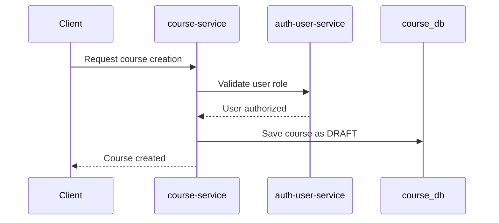
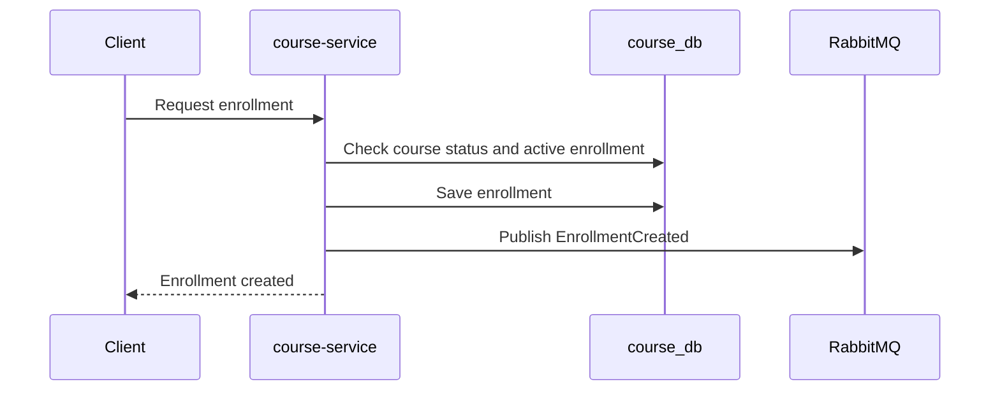

# HLD-002: course-service

## 1. Metadados

- Versão: 0.1
- Status: Draft
- Responsável técnico: EAD Platform
- Última atualização: 2026-05-10
- Público-alvo: desenvolvedores, revisores técnicos e agentes de IA

## 2. Objetivo técnico

Descrever a arquitetura de alto nível do `course-service`, responsável pelo bounded context Course.

O componente resolve o problema arquitetural de gerenciar cursos, módulos, aulas e matrículas sem acoplar sua persistência ao `auth-user-service` ou a outros contextos.

## 3. Escopo arquitetural

### Incluído

- Gestão técnica de cursos, módulos, aulas e matrículas.
- Banco próprio `course_db`.
- APIs REST para fluxos de curso e matrícula, conforme FDDs futuros.
- Validação síncrona de usuário e papéis via `auth-user-service`.
- Publicação de `EnrollmentCreated`.

### Fora de escopo

- Implementação do serviço nesta fase.
- Regras de autenticação e emissão de tokens.
- Persistência de usuários.
- Consumo de eventos.
- Pagamentos e liberação de acesso pago.
- Detalhamento de endpoints completos.
- SQL de migrações.

## 4. Responsabilidades

O `course-service` deve:

- ser a fonte de verdade para cursos;
- controlar status de cursos, como `DRAFT` e `PUBLISHED`;
- gerenciar matrículas;
- impedir matrícula em curso não publicado;
- impedir matrícula ativa duplicada;
- validar permissões de criação de curso sem acessar banco do `auth-user-service`;
- publicar `EnrollmentCreated` após criação bem-sucedida de matrícula.

## 5. Arquitetura interna de alto nível

O serviço deve seguir separação por camadas:

- domínio: regras de curso, publicação e matrícula;
- aplicação: casos de uso e portas;
- infraestrutura web: adapters REST de entrada;
- infraestrutura de persistência: adapters para PostgreSQL;
- infraestrutura de integração REST: client para `auth-user-service`;
- infraestrutura de mensageria: publicação de eventos no RabbitMQ.

Controllers devem apenas validar entrada, chamar casos de uso e retornar respostas. Regras sobre curso publicado, permissões e matrícula duplicada devem ficar no domínio ou aplicação.

## 6. Dependências

### Dependências internas

- `auth-user-service` para validação de usuário e papéis via REST.
- HLD global em `docs/hld.md`.
- Domain Context para regras RN-008 a RN-015.

### Dependências externas

- PostgreSQL `course_db`.
- RabbitMQ para publicação de eventos.
- Java 25.
- Spring Boot 4.
- Gradle 9.x.

## 7. Modelo de dados em alto nível

Fonte de verdade:

- `course-service` é dono dos dados de cursos, módulos, aulas e matrículas.

Entidades principais:

- `Course`: curso em rascunho ou publicado.
- `Module`: agrupamento de aulas dentro de curso. Hipótese baseada no HLD global.
- `Lesson`: aula pertencente a módulo. Hipótese baseada no HLD global.
- `Enrollment`: matrícula de estudante em curso.

Relacionamentos principais:

- um curso pode possuir módulos;
- um módulo pode possuir aulas;
- uma matrícula relaciona `studentId` e `courseId`;
- `studentId` e `teacherId` são referências lógicas a usuários, não chaves para banco do `auth-user-service`.

## 8. Interfaces públicas

| Interface | Tipo | Descrição | Status |
| --- | --- | --- | --- |
| Course management API | REST | Criação, publicação e manutenção de cursos. | draft |
| Enrollment API | REST | Criação e consulta de matrículas. | draft |
| Auth/User validation client | REST | Chamada para validar usuário e papéis no `auth-user-service`. | draft |
| `EnrollmentCreated` | Event | Evento publicado após criação de matrícula. | planned |

## 9. Comunicação síncrona

Comunicação recebida:

- clientes externos chamarão APIs REST de cursos e matrículas.

Comunicação realizada:

- `course-service` chamará o `auth-user-service` quando precisar validar permissões como `TEACHER` ou `ADMIN`.

Diretrizes:

- chamadas ao `auth-user-service` devem ter timeout;
- falhas de autorização e comunicação devem ter tratamento explícito;
- o serviço nunca deve consultar diretamente `auth_user_db`;
- contratos REST devem ser documentados em FDDs específicos.

## 10. Comunicação assíncrona

Eventos publicados:

- `EnrollmentCreated`, após criação bem-sucedida de matrícula.

A routing key inicial para `EnrollmentCreated` deve seguir o ADR-007: `course.enrollment-created`.

Eventos consumidos:

- nenhum evento definido para consumo na fase inicial.

O evento deve representar fato ocorrido e não intenção de matrícula.

## 11. Fluxos principais

### Criação de curso

### Matrícula e evento

## 12. Segurança

Diretrizes:

- criação de curso deve ser permitida apenas para `TEACHER` ou `ADMIN`;
- matrícula deve ser realizada por usuário com papel compatível com estudante, conforme FDD futuro;
- autorização deve ser validada via contrato do `auth-user-service` ou token quando estratégia for definida;
- o serviço não deve armazenar credenciais;
- tokens e autenticação entre serviços ainda exigem ADR.

## 13. Observabilidade

O serviço deve registrar:

- criação e publicação de cursos;
- tentativa e resultado de matrícula;
- falhas de autorização;
- chamadas REST ao `auth-user-service`;
- publicação de `EnrollmentCreated`.

Health checks esperados:

- aplicação;
- PostgreSQL `course_db`;
- RabbitMQ quando publicação estiver ativa;
- dependência REST crítica quando for necessário.

Logs devem carregar correlation id quando disponível. Eventos devem carregar `eventId`.

### Testes e validação esperados

O `course-service` deve ser validado com:

- testes unitários para regras de domínio de curso, publicação e matrícula;
- testes unitários para regras de matrícula em curso publicado;
- testes unitários para prevenção de matrícula ativa duplicada;
- testes de contrato HTTP para APIs de cursos e matrículas;
- testes de integração com Cucumber para criação e publicação de curso;
- testes de integração com Cucumber para criação de matrícula;
- testes de integração com Cucumber cobrindo chamada REST ao `auth-user-service` para validação de papéis;
- testes de integração com Cucumber cobrindo publicação de `EnrollmentCreated`.

Cenários Cucumber devem representar fluxos de negócio observáveis e integrações entre adapters, mantendo regras detalhadas no FDD e plano correspondente.

## 14. Escalabilidade, resiliência e disponibilidade

Considerações:

- chamadas REST ao `auth-user-service` exigem timeout e tratamento de indisponibilidade;
- matrícula deve prevenir duplicidade por regra de aplicação e restrição no banco;
- publicação de `EnrollmentCreated` precisa de estratégia confiável antes de uso crítico;
- consumidores futuros devem lidar com duplicidade de eventos;
- cache de permissões é hipótese futura e deve ser avaliado por ADR se introduzido.

## 15. Riscos arquiteturais

| Risco | Probabilidade | Impacto | Mitigação | Contingência |
| --- | --- | --- | --- | --- |
| Acoplamento operacional por chamadas síncronas ao `auth-user-service`. | média | médio | Usar REST apenas quando resposta imediata for necessária. | Degradar operação ou usar cache com ADR futura. |
| Matrícula duplicada em concorrência. | média | alto | Usar regra de domínio e restrição de banco. | Corrigir dados por rotina administrativa. |
| Publicação de `EnrollmentCreated` falhar após salvar matrícula. | média | alto | Definir outbox ou estratégia confiável em ADR. | Reprocessar eventos a partir de fonte local futura. |
| Contratos de autorização instáveis. | média | médio | Versionar contrato REST ou token. | Congelar contrato em FDD/ADR antes de uso amplo. |

## 16. ADRs associados

### ADRs existentes

- `ADR-001: Microservices with Database per Service`
- `ADR-007: RabbitMQ Topology and Retry/DLQ Strategy`

### ADRs pendentes

- Estratégia de autenticação e autorização entre serviços.
- Estratégia de API Gateway ou exposição direta.
- Publicação confiável de eventos.
- Estratégia de migração de banco por serviço.
- Versionamento de APIs REST.

## 17. Relação com FDDs e planos

Não há FDD ou plano específico para `course-service` neste momento.

FDDs futuros devem cobrir, no mínimo:

- criação de curso;
- publicação de curso;
- criação de matrícula;
- validação de permissões via `auth-user-service`;
- publicação de `EnrollmentCreated`.

## 18. Próximos passos técnicos

- Criar FDD para criação e publicação de cursos.
- Criar FDD para matrículas.
- Definir contrato de validação com `auth-user-service`.
- Definir cenários Cucumber para cursos, matrículas e validação de papéis.
- Criar ADR para autenticação/autorização entre serviços.
- Criar plano de implementação antes de código.
