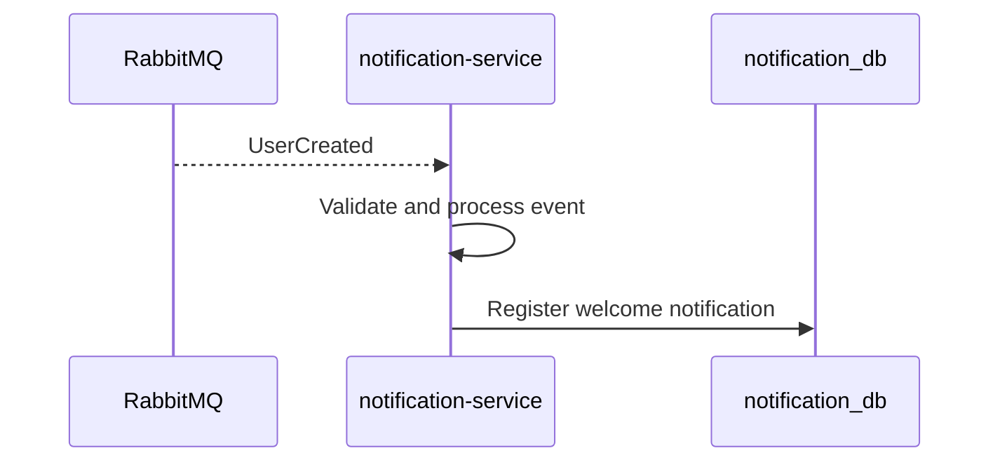
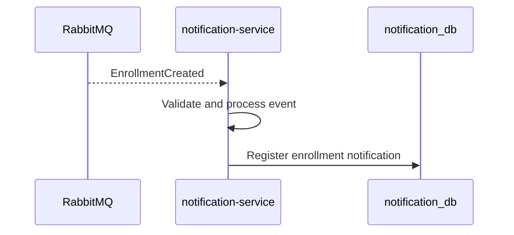

# HLD-003: notification-service

## 1. Metadados

- Versão: 0.1
- Status: Draft
- Responsável técnico: EAD Platform
- Última atualização: 2026-05-10
- Público-alvo: desenvolvedores, revisores técnicos e agentes de IA

## 2. Objetivo técnico

Descrever a arquitetura de alto nível do `notification-service`, responsável pelo bounded context Notification.

O componente resolve o problema arquitetural de reagir a eventos de domínio e registrar notificações sem acoplar `auth-user-service` e `course-service` a lógica de notificação.

## 3. Escopo arquitetural

### Incluído

- Consumo futuro de `UserCreated`.
- Consumo futuro de `EnrollmentCreated`.
- Registro de notificações no banco próprio `notification_db`.
- Histórico e status de notificações.
- Processamento idempotente de eventos.
- Observabilidade de consumo e falhas.

### Fora de escopo

- Implementação do serviço nesta fase.
- Envio real por e-mail, SMS ou push.
- Templates avançados de mensagem.
- Gestão de preferências de notificação.
- Publicação de eventos na fase inicial.
- Acesso direto a bancos de outros serviços.

## 4. Responsabilidades

O `notification-service` deve:

- consumir eventos relevantes do RabbitMQ;
- registrar notificação de boas-vindas ao consumir `UserCreated`;
- registrar notificação de matrícula ao consumir `EnrollmentCreated`;
- manter status e histórico de notificações;
- evitar duplicidade de processamento;
- isolar falhas de notificação dos serviços produtores.

## 5. Arquitetura interna de alto nível

O serviço deve seguir separação por camadas:

- domínio: regras e modelo de notificação;
- aplicação: casos de uso para processar eventos e registrar notificações;
- infraestrutura de mensageria: consumers RabbitMQ;
- infraestrutura de persistência: adapters PostgreSQL;
- infraestrutura de observabilidade: logs, métricas e health checks.

Consumers não devem conter regras de negócio. Eles devem traduzir mensagens para casos de uso e delegar processamento à aplicação.

## 6. Dependências

### Dependências internas

- Eventos publicados por `auth-user-service`.
- Eventos publicados por `course-service`.
- HLD global em `docs/hld.md`.
- Domain Context para regras RN-016 a RN-019.

### Dependências externas

- RabbitMQ para consumo de eventos.
- PostgreSQL `notification_db`.
- Java 25.
- Spring Boot 4.
- Gradle 9.x.

## 7. Modelo de dados em alto nível

Fonte de verdade:

- `notification-service` é dono dos dados de notificações registradas e status de processamento.

Entidades principais:

- `Notification`: representa uma notificação gerada ou pendente.
- `NotificationStatus`: status de processamento/envio. Valores finais ainda precisam ser definidos em FDD.
- `ProcessedEvent`: registro local de `eventId` processado para idempotência, conforme ADR-007.

Dados de outros contextos:

- `userId`, `email`, `courseId` ou `enrollmentId` podem ser armazenados como referências lógicas quando vierem de eventos;
- o serviço não deve consultar bancos de origem para enriquecer dados.

## 8. Interfaces públicas

| Interface | Tipo | Descrição | Status |
| --- | --- | --- | --- |
| `UserCreated` consumer | Event | Consome evento de usuário criado e registra notificação de boas-vindas. | planned |
| `EnrollmentCreated` consumer | Event | Consome evento de matrícula criada e registra notificação de matrícula. | planned |
| Notification query API | REST | Consulta futura de notificações registradas. | draft |

## 9. Comunicação síncrona

Não há comunicação síncrona obrigatória definida para a fase inicial.

Uma API REST de consulta de notificações pode existir no futuro, mas deve ser definida em FDD específico antes de implementação.

O serviço não deve chamar diretamente bancos de outros serviços. Chamadas REST para enriquecimento de dados são hipótese futura e devem ser justificadas por FDD/ADR.

## 10. Comunicação assíncrona

Eventos consumidos:

- `UserCreated`;
- `EnrollmentCreated`.

Eventos publicados:

- nenhum evento definido para publicação na fase inicial.

Diretrizes:

- consumers devem ser idempotentes;
- falhas devem permitir retry;
- mensagens com falha persistente devem ser encaminhadas para DLQ conforme ADR-007;
- eventos devem ser processados como fatos já ocorridos.

## 11. Fluxos principais

### Notificação de boas-vindas

### Notificação de matrícula

## 12. Segurança

Diretrizes:

- eventos não devem conter senha, hash ou credenciais;
- logs não devem expor dados sensíveis;
- o serviço deve tratar payloads externos como não confiáveis;
- autenticação de acesso ao RabbitMQ deve vir de configuração;
- APIs REST futuras devem seguir a estratégia global de autenticação quando definida.

## 13. Observabilidade

O serviço deve registrar:

- recebimento de evento com `eventId`;
- início e fim do processamento;
- falhas de validação de payload;
- falhas de persistência;
- retries e envio para DLQ conforme ADR-007;
- notificações registradas.

Métricas esperadas:

- eventos recebidos;
- eventos processados com sucesso;
- eventos com falha;
- tempo de processamento;
- tamanho de fila, quando disponível.

Health checks esperados:

- aplicação;
- RabbitMQ;
- PostgreSQL `notification_db`.

### Testes e validação esperados

O `notification-service` deve ser validado com:

- testes unitários para regras de criação e status de notificação;
- testes unitários para processamento de payloads de eventos;
- testes unitários para idempotência por `eventId`;
- testes de integração com Cucumber para consumo de `UserCreated` e registro de notificação de boas-vindas;
- testes de integração com Cucumber para consumo de `EnrollmentCreated` e registro de notificação de matrícula;
- testes de integração com Cucumber para mensagens duplicadas;
- testes de integração com Cucumber para falhas de payload e comportamento de retry/DLQ.

Cenários Cucumber devem validar o comportamento do consumidor a partir de eventos de entrada e estado persistido esperado, sem acoplar a testes de classes internas.

## 14. Escalabilidade, resiliência e disponibilidade

Considerações:

- o serviço deve escalar consumidores horizontalmente quando houver idempotência;
- duplicidade de eventos deve ser considerada comportamento esperado;
- retry deve ser limitado para evitar loops infinitos;
- DLQ deve existir antes de uso real em fluxos críticos;
- processamento deve ser tolerante a indisponibilidade temporária do banco.

## 15. Riscos arquiteturais

| Risco | Probabilidade | Impacto | Mitigação | Contingência |
| --- | --- | --- | --- | --- |
| Processamento duplicado de eventos. | alta | médio | Implementar idempotência por `eventId`. | Remover duplicidades por rotina administrativa. |
| Evento inválido bloquear fila. | média | alto | Validar payload e usar DLQ. | Isolar mensagem inválida e reprocessar depois. |
| Falha no banco durante consumo. | média | médio | Retry com backoff. | Pausar consumer até recuperação. |
| Payload de evento insuficiente para notificação. | média | médio | Versionar evento e definir payload mínimo em FDD/ADR. | Criar fluxo de compensação ou enriquecer via contrato futuro. |

## 16. ADRs associados

### ADRs existentes

- `ADR-001: Microservices with Database per Service`
- `ADR-004: Testing Strategy`
- `ADR-007: RabbitMQ Topology and Retry/DLQ Strategy`

### ADRs pendentes

- Versionamento de eventos.
- Estratégia de observabilidade para consumidores.
- Estratégia de migração de banco por serviço.

## 17. Relação com FDDs e planos

Não há FDD ou plano específico para `notification-service` neste momento.

FDDs futuros devem cobrir, no mínimo:

- consumo de `UserCreated`;
- registro de notificação de boas-vindas;
- consumo de `EnrollmentCreated`;
- registro de notificação de matrícula;
- idempotência e tratamento de falhas.

## 18. Próximos passos técnicos

- Criar FDD para consumo de `UserCreated`.
- Criar FDD para consumo de `EnrollmentCreated`.
- Definir cenários Cucumber para consumo, idempotência e falhas de eventos.
- Criar plano de implementação antes de código.
- Definir status mínimos de `Notification`.
