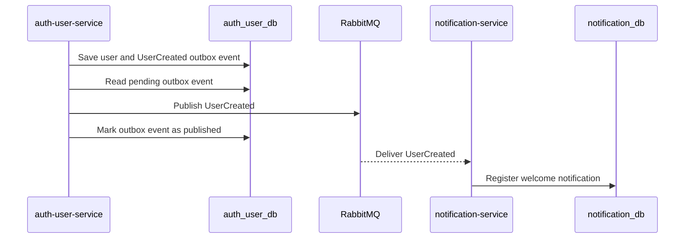
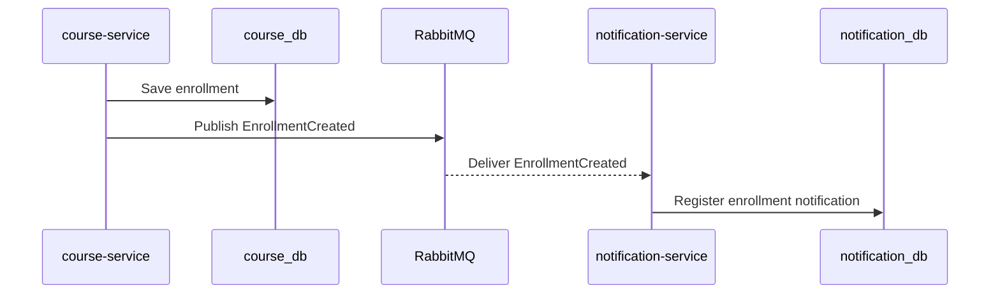

# HLD-004: Event-Driven Communication

## 1. Metadados

- Versão: 0.1
- Status: Draft
- Responsável técnico: EAD Platform
- Última atualização: 2026-05-10
- Público-alvo: desenvolvedores, revisores técnicos e agentes de IA

## 2. Objetivo técnico

Descrever a arquitetura de alto nível da comunicação orientada a eventos da EAD Platform.

O componente resolve o problema arquitetural de desacoplar serviços em fluxos que não exigem resposta imediata, preservando autonomia de dados e permitindo consistência eventual entre contextos.

## 3. Escopo arquitetural

### Incluído

- Uso de RabbitMQ como broker de eventos.
- Eventos iniciais `UserCreated` e `EnrollmentCreated`.
- Diretrizes para publicação e consumo.
- Envelope mínimo de eventos.
- Idempotência, retry, DLQ e riscos de consistência eventual em alto nível.
- Relação com `auth-user-service`, `course-service` e `notification-service`.

### Fora de escopo

- Implementação de producers e consumers.
- Configuração linha a linha de RabbitMQ.
- Payloads completos além do necessário para orientar FDDs.
- Substituição de chamadas REST por eventos quando resposta imediata for necessária.
- Integração com sistemas externos de mensageria.

## 4. Responsabilidades

A comunicação orientada a eventos deve:

- transportar fatos de domínio entre serviços;
- reduzir acoplamento temporal entre produtores e consumidores;
- permitir que consumidores reajam de forma independente;
- preservar isolamento de bancos por serviço;
- evitar dados sensíveis em mensagens;
- suportar rastreabilidade por `eventId` e correlation id;
- permitir evolução compatível de contratos.

## 5. Arquitetura interna de alto nível

O desenho de eventos deve considerar:

- producers: serviços que publicam eventos após mudanças locais relevantes;
- broker: RabbitMQ localmente via Docker Compose;
- consumers: serviços que processam eventos e atualizam estado próprio;
- event envelope: metadados comuns de identificação, tipo e tempo;
- payload: dados mínimos necessários para o consumidor executar sua responsabilidade.

Eventos não devem ser usados como comandos. Um evento declara algo que já aconteceu.

## 6. Dependências

### Dependências internas

- `auth-user-service`, produtor de `UserCreated`.
- `course-service`, produtor de `EnrollmentCreated`.
- `notification-service`, consumidor inicial dos eventos.
- HLD global em `docs/hld.md`.

### Dependências externas

- RabbitMQ.
- Docker Compose para infraestrutura local.
- PostgreSQL dos serviços produtores e consumidores, cada um isolado por serviço.

## 7. Modelo de dados em alto nível

Modelo lógico de evento:

- `eventId`: identificador único do evento;
- `eventType`: tipo do evento;
- `occurredAt`: data/hora em que o fato ocorreu;
- `payload`: dados do fato ocorrido.

Eventos iniciais:

- `UserCreated`;
- `EnrollmentCreated`.

O broker não é fonte de verdade de domínio. A fonte de verdade permanece no banco do serviço produtor.

Quando um producer usa outbox, a fonte local para eventos pendentes passa a ser a tabela de outbox do próprio serviço produtor, e não o broker.

## 8. Interfaces públicas

| Interface | Tipo | Descrição | Status |
| --- | --- | --- | --- |
| `UserCreated` | Event | Publicado quando usuário é criado no `auth-user-service`. | planned |
| `EnrollmentCreated` | Event | Publicado quando matrícula é criada no `course-service`. | planned |
| RabbitMQ Management UI | Operational | Interface local de administração do broker em `15672`. | implemented |

## 9. Comunicação síncrona

Este HLD não define comunicação síncrona entre serviços.

Regra de separação:

- REST deve ser usado quando a operação precisa de resposta imediata;
- eventos devem ser usados para fatos que podem ser processados de forma assíncrona.

Exemplo:

- validar papel de usuário para criar curso tende a exigir REST;
- notificar usuário após criação tende a usar evento.

## 10. Comunicação assíncrona

Fluxos iniciais:

- `auth-user-service` registra `UserCreated` na outbox e publica o evento por relay assíncrono;
- `course-service` publica `EnrollmentCreated`;
- `notification-service` consome `UserCreated`;
- `notification-service` consome `EnrollmentCreated`.

Diretrizes:

- produtores devem registrar eventos em mecanismo confiável após persistência bem-sucedida do fato;
- o `auth-user-service` usa outbox transacional para gravar `UserCreated` na mesma transação do usuário;
- o relay da outbox publica apenas eventos com `status = PENDING` e `next_attempt_at` vencido;
- após sucesso, o producer deve atualizar o registro para `PUBLISHED`;
- após falha final, o producer deve atualizar o registro para `FAILED`;
- eventos não devem conter senha, hash ou segredos;
- consumers devem ser idempotentes;
- cada evento deve carregar `eventId`;
- falhas devem ser observáveis;
- retry e DLQ devem ser definidos antes de uso crítico;
- a topologia inicial de RabbitMQ, retry e DLQ é definida no ADR-007.

No producer, retry de publicação e controle de status pertencem ao mecanismo de outbox. No consumer, retry, DLQ e idempotência pertencem ao processamento da mensagem já entregue pelo broker.

## 11. Fluxos principais

### UserCreated

### EnrollmentCreated

## 12. Segurança

Diretrizes:

- eventos não devem carregar credenciais;
- `UserCreated` não deve conter senha nem hash;
- dados pessoais devem ser mínimos e justificados por necessidade do consumidor;
- credenciais RabbitMQ devem vir de configuração;
- acesso ao Management UI é local para desenvolvimento;
- autenticação e autorização de producers/consumers em ambientes não locais ainda exigem decisão futura.

## 13. Observabilidade

Observabilidade mínima:

- logs de publicação com `eventId`, `eventType` e serviço produtor;
- logs de registro e atualização de outbox com `eventId`, `eventType`, status e tentativa;
- logs de consumo com `eventId`, `eventType` e serviço consumidor;
- métricas de publicação e consumo;
- métricas de falhas e retries;
- monitoramento de filas no RabbitMQ;
- correlation id quando o evento se originar de requisição HTTP.

Falhas de publicação e consumo devem ser visíveis nos logs e métricas.

### Testes e validação esperados

A comunicação orientada a eventos deve ser validada com:

- testes unitários para criação e validação do envelope de eventos;
- testes unitários para serialização e desserialização de payloads;
- testes unitários para regras que impedem dados sensíveis em eventos;
- testes de migration e persistência para a outbox do produtor;
- testes do relay assíncrono para publicação, retry e falha final;
- testes de integração com Cucumber para o fluxo `UserCreated` entre produtor, broker e consumidor;
- testes de integração com Cucumber para o fluxo `EnrollmentCreated` entre produtor, broker e consumidor;
- testes de integração com Cucumber para entrega duplicada e idempotência;
- testes de integração com Cucumber para falha de consumo, retry e DLQ conforme ADR-007.

Cenários Cucumber devem cobrir contratos e comportamento entre componentes, não detalhes de RabbitMQ ou implementação de adapters.

## 14. Escalabilidade, resiliência e disponibilidade

Considerações:

- RabbitMQ permite desacoplamento temporal, mas não elimina necessidade de idempotência;
- producers devem lidar com indisponibilidade do broker;
- producers com outbox devem tratar `PENDING`, `PUBLISHED` e `FAILED` como estados explícitos da publicação;
- consumers devem lidar com entrega duplicada;
- falhas entre publicação no broker e atualização do estado local podem exigir republicação segura do mesmo `eventId`;
- retry sem limite pode causar loops;
- DLQ deve isolar mensagens com falha persistente;
- outbox transacional é a estratégia aceita para coordenar persistência local e publicação de eventos do `auth-user-service`.

## 15. Riscos arquiteturais

| Risco | Probabilidade | Impacto | Mitigação | Contingência |
| --- | --- | --- | --- | --- |
| Perda de evento após persistência local. | média | alto | Usar outbox transacional no produtor quando definido em ADR. | Reprocessar eventos pendentes ou com falha a partir da outbox do serviço produtor. |
| Publicação duplicada por retry do producer ou falha após envio ao broker. | média | médio | Rastrear publicação por `eventId`, status da outbox e política de retry controlada. | Consumidores devem confirmar mensagens de forma idempotente. |
| Processamento duplicado por consumers. | alta | médio | Idempotência por `eventId`. | Rotina de deduplicação. |
| Mensagem inválida bloquear consumo. | média | alto | Validar payload e usar DLQ. | Quarentena e reprocessamento manual. |
| Payload evoluir quebrando consumidores. | média | alto | Versionamento de eventos. | Manter compatibilidade ou criar novo tipo/versão. |
| Exposição de dados sensíveis em evento. | baixa | alto | Revisão de contrato e testes. | Revogar/rotacionar dados afetados e corrigir payload. |

## 16. ADRs associados

### ADRs existentes

- `ADR-001: Microservices with Database per Service`
- `ADR-002: Password Hashing Strategy`, relacionado indiretamente à restrição de dados sensíveis em `UserCreated`.
- `ADR-006: Transactional Outbox for Domain Events`, define outbox para eventos do `auth-user-service`.
- `ADR-007: RabbitMQ Topology and Retry/DLQ Strategy`, define exchanges, routing keys, retry, DLQ e idempotência esperada.

### ADRs pendentes

- Versionamento de eventos.
- Observabilidade de mensageria.

## 17. Relação com FDDs e planos

Documentos relacionados:

- `docs/fdds/fdd-001-auth-user-service.md`, que define `UserCreated`.
- `docs/implementation-plans/plan-001-auth-user-service.md`, que prevê registro transacional do evento, relay assíncrono da outbox e cobertura de publicação de `UserCreated`.

FDDs futuros devem detalhar `EnrollmentCreated`, consumers do `notification-service`, idempotência e tratamento de falhas.

## 18. Próximos passos técnicos

- Implementar a topologia RabbitMQ definida no ADR-007.
- Definir contrato versionado de `UserCreated`.
- Definir contrato versionado de `EnrollmentCreated`.
- Definir cenários Cucumber para fluxos assíncronos entre produtores, RabbitMQ e consumidores.
- Criar FDDs de consumo de eventos no `notification-service`.
